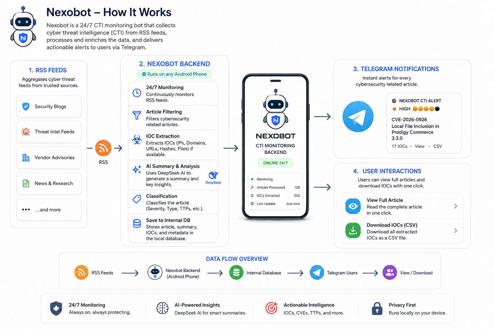
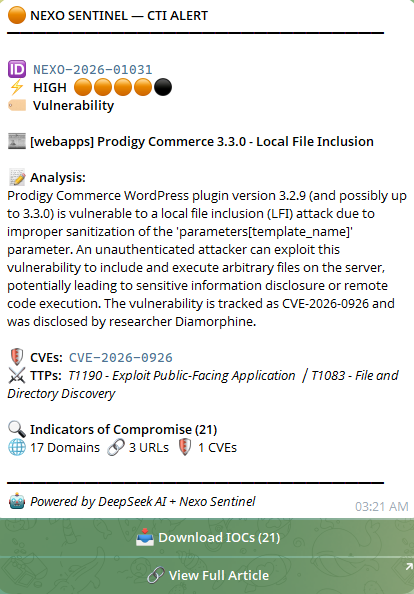
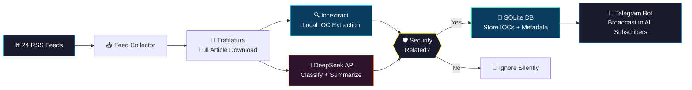

<p align="center">
  
</p>

<h1 align="center">🔐 Nexo Sentinel</h1>
<h3 align="center">AI-Powered Cyber Threat Intelligence System</h3>

<p align="center">
  
  
  
  
  
</p>

<p align="center">
  <b>A fully autonomous CTI pipeline running on a Pixel 5 phone via Termux.</b><br/>
  Monitors 24 security feeds, extracts IOCs locally, classifies threats with AI,<br/>
  and delivers real-time alerts to Telegram — all from your pocket.
</p>

---

## 📸 Live Alert Preview

<p align="center">
  
</p>

---

## 🧬 How It Works

Nexo Sentinel runs a **hybrid intelligence pipeline** that splits work between local processing and AI:



### Pipeline Steps

| Step | Tool | What Happens | Cost |
|:----:|:----:|:-------------|:----:|
| 1️⃣ | **Feedparser** | Polls 24 RSS feeds every 30 minutes | Free |
| 2️⃣ | **Trafilatura** | Downloads full article text (strips ads, nav, footers) | Free |
| 3️⃣ | **iocextract** | Extracts IPs, domains, hashes, URLs, CVEs, emails locally | Free |
| 4️⃣ | **DeepSeek** | Classifies threat category, severity, TTPs, actors (5K chars) | ~$0.003 |
| 5️⃣ | **Telegram** | Sends rich notification with IOC counts + action buttons | Free |

---

## 🏗️ Architecture

```
┌─────────────────────────────────────────────────────────────┐
│                    PIXEL 5 (Termux)                         │
│                                                             │
│  ┌──────────┐  ┌──────────────┐  ┌────────────────────┐    │
│  │ RSS Feed │  │  Trafilatura │  │    iocextract       │    │
│  │ Collector│─▶│  (Full Text) │─▶│  (Local IOCs)       │    │
│  │ 24 feeds │  │  No truncate │  │  IPs, Domains,      │    │
│  └──────────┘  └──────┬───────┘  │  Hashes, CVEs,      │    │
│                       │          │  URLs, Emails        │    │
│                       ▼          └─────────┬────────────┘    │
│              ┌──────────────┐              │                │
│              │ DeepSeek API │              │                │
│              │ (5K chars)   │              │                │
│              │ • Classify   │              │                │
│              │ • Summarize  │              │                │
│              │ • TTPs       │              │                │
│              │ • Actors     │              │                │
│              └──────┬───────┘              │                │
│                     │                      │                │
│                     ▼                      ▼                │
│              ┌──────────────────────────────────┐           │
│              │         SQLite Database          │           │
│              │  Articles • IOCs • Subscribers   │           │
│              └──────────────┬───────────────────┘           │
│                             │                               │
│                             ▼                               │
│              ┌──────────────────────────────────┐           │
│              │       Telegram Bot (Public)      │           │
│              │  • CTI Alerts with IOC counts    │           │
│              │  • Download IOCs (CSV)           │           │
│              │  • View Full Article             │           │
│              │  • /search, /latest, /stats      │           │
│              └──────────────────────────────────┘           │
└─────────────────────────────────────────────────────────────┘
```

---

## 🔑 Key Features

### 🧠 Hybrid Intelligence Pipeline
- **Local IOC extraction** using `iocextract` — no API calls, no cost, instant results
- **AI classification** via DeepSeek — only sends 5K chars for classify + summarize
- **70% token savings** compared to sending full articles to the AI

### 🔍 Smart IOC Extraction
- Extracts **IPv4/IPv6**, **domains**, **URLs**, **MD5/SHA1/SHA256**, **CVEs**, **emails**
- Handles **defanged indicators** (`hxxp://`, `[.]com`, etc.)
- **Filters out noise**: private IPs, legitimate domains (google.com, github.com, etc.), article's own URL
- Full subdomain capture (`demo.evil-domain.com` → not just `evil-domain.com`)

### 🤖 AI-Powered Classification
- **DeepSeek API** classifies articles into: Malware, Vulnerability, Exploit, Zero-Day, Ransomware, Phishing, APT, Data Breach, DDoS, Supply Chain
- **Severity scoring**: Critical → High → Medium → Low → Info
- **MITRE ATT&CK TTPs** extraction with technique IDs
- **Threat actor identification** with known aliases
- Non-security articles silently ignored (no spam!)

### 📱 Telegram Bot (Public)
- **Anyone can subscribe** — just `/start` the bot
- **Real-time CTI alerts** with rich formatting
- **Download IOCs** as CSV with one tap
- **View full article** via inline button
- Commands: `/latest`, `/search`, `/stats`, `/threats`, `/subscribe`

### 📡 24 Threat Intelligence Feeds
| Category | Sources |
|:---------|:--------|
| **Government** | CISA Alerts, US-CERT |
| **News** | The Hacker News, BleepingComputer, Dark Reading, SecurityWeek, Krebs on Security, The Record |
| **Vendors** | Microsoft, CrowdStrike, Mandiant, SentinelOne, Palo Alto Unit 42, Recorded Future, Kaspersky, ESET, Fortinet, Check Point |
| **Research** | Huntress, The DFIR Report, Any.Run, Wordfence |
| **Exploits** | Exploit-DB |
| **General** | Hacker News (security-filtered by AI) |

---

## 🚀 Deployment Guide

### Prerequisites
- **Any Android phone**  with [Termux](https://f-droid.org/packages/com.termux/) installed
- **Python 3.11+** (`pkg install python`)
- **DeepSeek API key** (get one at [platform.deepseek.com](https://platform.deepseek.com))
- **Telegram Bot Token** (create via [@BotFather](https://t.me/BotFather))

### Step 1: Clone & Install

```bash
# Clone the repository
git clone https://github.com/bluewhalecolombo/nexo-sentinel-agent.git
cd nexo-sentinel-agent

# Install Python dependencies
pip install -r requirements.txt
```

### Step 2: Configure Environment

```bash
cp .env.example .env
nano .env
```

```env
# Required
DEEPSEEK_API_KEY=sk-your-deepseek-api-key-here
TELEGRAM_BOT_TOKEN=your-telegram-bot-token-here
TELEGRAM_USER_ID=your-telegram-user-id

# Optional
DEEPSEEK_ENABLED=true
```

### Step 3: Start

```bash
bash start_nexo.sh
```

That's it! The bot will:
1. Initialize the SQLite database
2. Populate 24 RSS feed sources
3. Start fetching articles immediately
4. Process them through the hybrid pipeline
5. Send Telegram alerts for security-related findings

### Management Commands

```bash
bash start_nexo.sh            # Start the bot
bash start_nexo.sh stop       # Stop all instances
bash start_nexo.sh restart    # Stop + start
bash start_nexo.sh logs       # Tail live logs
bash start_nexo.sh status     # Check if running
bash start_nexo.sh update     # Git pull + restart
```

---

## 📊 Performance

| Metric | Value |
|:-------|:------|
| **Articles processed** | ~720 per fresh start |
| **Processing speed** | ~3 seconds per article |
| **API cost per article** | ~$0.003 (DeepSeek) |
| **IOC extraction** | Free (local regex) |
| **Feed polling interval** | Every 30 minutes |
| **Article processing** | Every 2 minutes |
| **Memory usage** | ~50MB on Any Android phone |

---

## 🗂️ Project Structure

```
nexo-sentinel-agent/
├── nexo_backend/
│   ├── ai/
│   │   └── summarizer.py       # DeepSeek API — classify + summarize
│   ├── db/
│   │   ├── database.py         # SQLite async operations
│   │   └── schema.sql          # Database schema
│   ├── export/
│   │   └── csv_exporter.py     # IOC CSV export for downloads
│   ├── feed/
│   │   └── collector.py        # RSS feed polling (24 sources)
│   ├── parser/
│   │   ├── article_parser.py   # Trafilatura full-text download
│   │   └── ioc_extractor.py    # iocextract-based IOC extraction
│   ├── telegram/
│   │   └── bot.py              # Public Telegram bot + notifications
│   ├── config.py               # Settings + feed source definitions
│   ├── main.py                 # Application entry point
│   └── scheduler.py            # Pipeline orchestrator (APScheduler)
├── .env.example                # Environment template
├── requirements.txt            # Python dependencies
├── start_nexo.sh               # Start/stop/update management script
└── README.md                   # This file
```

---

## 🛡️ IOC Filtering

The system automatically filters out false positives:

**Whitelisted Domains** (60+ legitimate domains excluded):
- Security vendors: Microsoft, CrowdStrike, Mandiant, Kaspersky, etc.
- Government: CISA, FBI, NIST, NCSC, Europol
- Infrastructure: Cloudflare, Akamai, VirusTotal, Shodan
- Social media: Twitter/X, LinkedIn, Reddit, YouTube
- News sources: BleepingComputer, The Hacker News, Dark Reading

**Whitelisted IPs** (private/internal ranges excluded):
- `10.0.0.0/8`, `172.16.0.0/12`, `192.168.0.0/16`, `127.0.0.0/8`
- CGNAT (`100.64.0.0/10`), Multicast (`224.0.0.0/4`)

---

## 🔧 Tech Stack

| Component | Technology | Purpose |
|:----------|:-----------|:--------|
| **Runtime** | Python 3.11+ | Core application |
| **AI Engine** | DeepSeek API | Classification + summarization |
| **IOC Extraction** | iocextract | Local regex-based IOC parsing |
| **Article Download** | Trafilatura | Full-text extraction from URLs |
| **Feed Parsing** | Feedparser | RSS/Atom feed collection |
| **Database** | SQLite (aiosqlite) | Persistent async storage |
| **Bot Framework** | python-telegram-bot | Telegram integration |
| **Scheduler** | APScheduler | Periodic task orchestration |
| **API Server** | Flask | REST API for dashboard data |
| **Platform** | Termux on Android phone | Mobile deployment |

---

## 📜 License

Made with ☕, late nights, and a love for cybersecurity.

You're welcome to use, modify, and share Nexobot. Just give credit where it's due and don't be a jerk by stealing the project.

Happy Hunting Lads! 🚀

---

<p align="center">
  <b>Built by Engimuz under project Bluewhale Colombo</b><br/>
  <i>Running 24/7 on Androind mobile </i>
</p>
